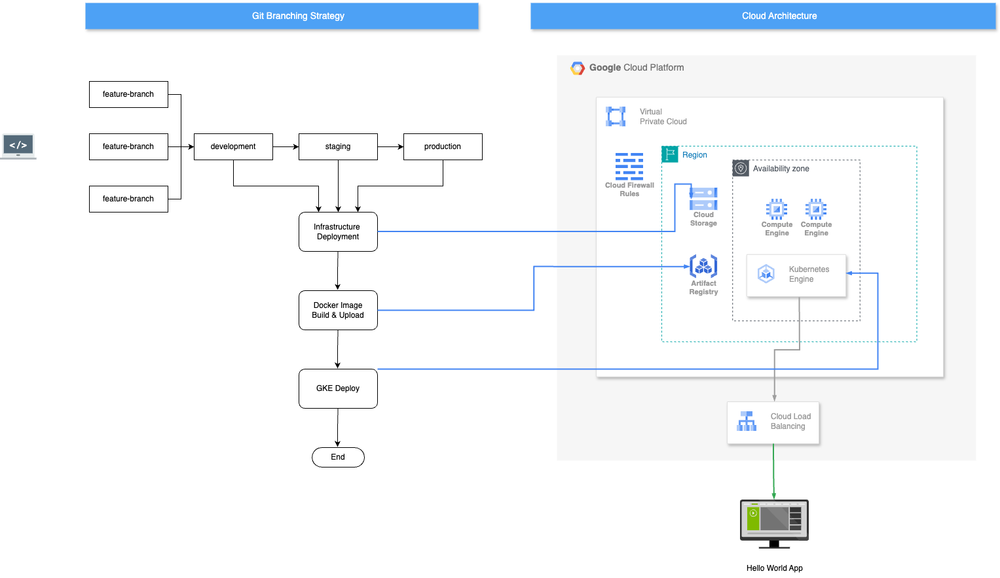

# Python Flask App Deployment with Terraform and GitHub Actions on Google Kubernetes Engine

This project demonstrates how to create a Google Kubernetes Engine (GKE) cluster using Terraform, deploy a Flask application with Docker and Helm charts, and automate the CI/CD pipeline using GitHub Actions.

## Table of Contents

- [Prerequisites](#prerequisites)
- [Setup Instructions](#setup-instructions)
  - [1. Create a Service Account for GitHub Actions](#1-create-a-service-account-for-github-actions)
  - [2. Create a Storage Bucket](#2-create-a-storage-bucket)
  - [3. Configure Terraform](#3-configure-terraform)
  - [4. Set Up GitHub Actions CI/CD Pipeline](#4-set-up-github-actions-cicd-pipeline)
- [Running the Application](#running-the-application)
- [License](#license)

## Prerequisites

Before you begin, ensure you have the following:

- A Google Cloud project.
- Terraform installed on your local machine.
- Docker installed on your local machine.
- Helm installed on your local machine.
- Google Cloud CLI configured on your local machine.

## Setup Instructions

Open setup.sh file available in project root directory.

Set the following variables:

SERVICE_ACCOUNT_NAME="github-actions"
PROJECT_ID="wired-torus123"
BUCKET_NAME="terraform-state-file-$PROJECT_ID"
REGION="australia-southeast1 "

Run the bash file to perform the following tasks.

### 1. Creating Service Account for GitHub Actions

1. The bash file creates service account name as `github-actions`
2. The following permissions are assigned:
   - Artifact Registry Administrator
   - Artifact Registry Writer
   - Compute Network Admin
   - Create Service Accounts
   - Kubernetes Engine Admin
   - Kubernetes Engine Cluster Admin
   - Service Account User
   - Service Usage Admin
   - Storage Object Admin
   - Security Admin
3. After service account is created generate a key for this service account and download the JSON key file.
4. Go to your GitHub repository and navigate to **Settings** > **Secrets and variables** > **Actions**.
5. Click on **New repository secret** and create a secret named `GOOGLE_APPLICATION_CREDENTIALS`, pasting the contents of the JSON key file.

### 2. Creates a Storage Bucket for State file

1. The bash file creates a storage bucket name as `terraform-state-file-<project-id>`
2. After the bucket is created open providers.tfvars file in terraform directory.
3. Set this bucket name as backend for terraform.

This bucket will be used to store the Terraform state file.

### 3. Configure Terraform

1. Open the `variables.tfvars` file 
2. Set the variables name

- **Project ID**: `wired-torus123`
- **Region**: `australia-southeast1`
- **Zone**: `australia-southeast1-a`
- **Artifact Registry Repository**: `web-app-docker`
- **GKE Cluster**: `web-app-cluster`
- **GKE Service Account**: `gke-service-account`
- **GKE Cluster Node Pool**: `web-app-node-pool`
- **Network Name**: `vpc-network`

### 4. Configuring CI/CD pipeline

1. Open the `web-app-dev` , `web-app-stage`, `web-app-prod` file 
2. Set the `GCP_PROJECT` variable with your project name.

## Running the Infrastructure

After successfully setting up the CI/CD pipeline, any changes pushed to your production, staging, development branch will trigger the workflow, building the Docker image and deploying the application on your GKE cluster. 

You can access your Flask application using the external IP of your GKE service.

## Architecture Diagram

Here is the architecture diagram for the project:

